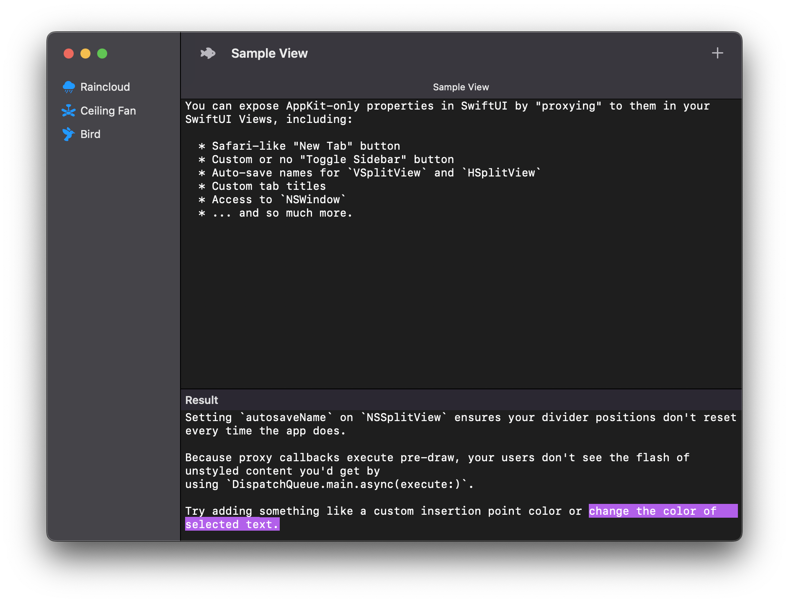

# NSViewProxy

`NSViewProxy`, its associated structs, and extensions on `SwiftUI.View` allow you to access the `NSView` and/or `NSWindow`/window members (e.g. `NSToolbar`, `NSTabBar`) in which a SwiftUI `View` will draw.

This is an improvement upon other accessor/proxy methods which rely on using `DispatchQueue.main.async(execute:)` to modify content after the first draw cycle.

`NSViewProxyView` executes any logic given in `NSViewProxy` callbacks *prior* to the first draw of modified SwiftUI `View`s — effectively eliminating any occurrences of FOUC (flash of unstyled content).

## Example App

<p align="center"></p>

<p align="center"><b><a href="https://github.com/stephancasas/NSViewProxyExample">Check out the repo for NSViewProxyExample</a></b></p>

## Usage

Simply chain the modifier onto the view whose context you wish to acquire:

```swift

import SwiftUI;
import AppKit;
import NSViewProxy;

// ...

TextEditor(text: self.$output)
    .font(.body.monospaced())
    .proxy(as: NSTextView.self, using: { nsTextView in
        
        /// # NSTextView
        ///
        /// Modify things like the insertion point color...
        ///
        nsTextView.insertionPointColor = .systemPink;
        ///
        /// ...or add a custom text highlight color.
        ///
        let attrString = NSMutableAttributedString(" ");
        attrString.addAttributes(
            nsTextView.selectedTextAttributes,
            range: NSMakeRange(0, 1));
        attrString.addAttributes(
            [NSAttributedString.Key.backgroundColor: NSColor.systemPurple],
            range: NSMakeRange(0, 1))
        nsTextView.selectedTextAttributes = attrString.attributes(
            at: 0, effectiveRange: nil);
    })

// ...

```

`NSViewProxy` offers a range of different ways to access `NSView` instances:

### Generic Access to Proxied SwiftUI View

Access the SwiftUI `View` itself without any typecasting.

#### Signature

```swift
.proxy(using: (NSView) -> Void)
```

#### Example

```swift
TextEditor(text: $text)
  .proxy{ nsView in 
    print(nsView.frame);
  }
```

### Typecast Access to Proxied SwiftUI View  

Access the SwiftUI `View` itself — typecasting to the given type (e.g. `NSButton.self`).

#### Signature

```swift
.proxy<T: NSView>(as: T.Type, using: (T) -> Void)
```

#### Example

```swift
TextEditor(text: $text)
  .proxy(as: NSTextView.self, using: { nsTextView in
    // Upcasting give us access to the `string` property. 
    print(nsTextView.string); 
  })
```

### Related `NSView` of Proxied SwiftUI View 

Access an ancestor or descendant of the SwiftUI View. 

#### Signature
 
```swift
`.proxy<T: NSView>(to: ViewRelationship<T>, using: (T) -> Void)`
```

#### Example (Typecast Descendant)

```swift
TextEditor(text: $text)
  .proxy(
    to: .closest(.descendant, representing: NSScrollView.self),
    using: { nsScrollView in 
      /// We can access the NSScrollView that's wrapped in
      /// `TextEditor`.
      /// 
      nsScrollView.scrollToEndOfDocument(nil);
  })
```

#### Example (Generic Ancestor by Regex)

```swift
TextEditor(text: $text)
  .proxy(
    to: .ancestor(like: /NSTabBar/),
    using: { nsTabBar in 
      ///  We can access the undocumented `NSTabBar`,
      ///  but you'll need a header file to use it...
      /// 
      /// ... or you can do something like this:  
      ///
      guard let buttons = (nsTextView as AnyObject)
        .value(forKey: "tabButtons") as? Array<NSButton> 
      else { return }
      
      print(buttons);
  })
```

#### Example (Generic Ancestor by Conditional)

```swift
TextEditor(text: $text)
  .proxy(
    to: .descendant(passing: { nsView in 
      guard let nsView as? NSClipView else {
        return false;
      }
      return true;
    }), using: { nsClipView in
      /// I don't have anything interesting to
      /// say about `NSClipView`, please keep
      /// reading. 
      ///
      print(nsClipView);
  })
```

### Any Element in `NSWindow`

`NSViewProxy` pre-defined utilities to access common elements in your SwiftUI app including:

| Utility | Description |
| :--- | :--- |
| `.window` | The `NSWindow` in which the proxied SwiftUI `View` will draw. |
| `.titlebarContainer` | The titlebar container of the `NSWindow` containing the proxied SwiftUI `View`. |
| `.titlebar` | The titlebar of the `NSWindow` containing the proxied SwiftUI `View` (yes, there's a difference). |
| `.toolbar` | The toolbar of the `NSWindow` containing the proxied SwiftUI `View`.  |
| `.contentView` | The outermost view of the `NSWindow` containing the proxied SwiftUI `View` before hitting `NSThemeFrame`.  |
| `.tab` | The current tab of the `NSWindow` containing the proxied SwiftUI `View`.  |
| `.tabBar` | The tab bar of the `NSWindow` containing the proxied SwiftUI `View` (undocumented).  |

#### Signature

```swift
.proxy<T: NSObject>(to: GlobalElement<T>, using: (T) -> Void)
```

#### Example

```swift
TextEditor(text: $text)
  .proxy(to: .toolbar, using: { nsToolbar in 
      /// We can customize the window's toolbar by
      /// adding or removing our own items.
      ///
      nsToolbar.removeItem(at: 0);      
  })
```

## Contributing

If you experience an issue, please raise one or feel free to open a PR. I can usually be reached via DM [on Twitter as @stephancasas](https://twitter.com/stephancasas), so please feel free to follow or get in touch if you'd like to see more of my work. 

## License

MIT
